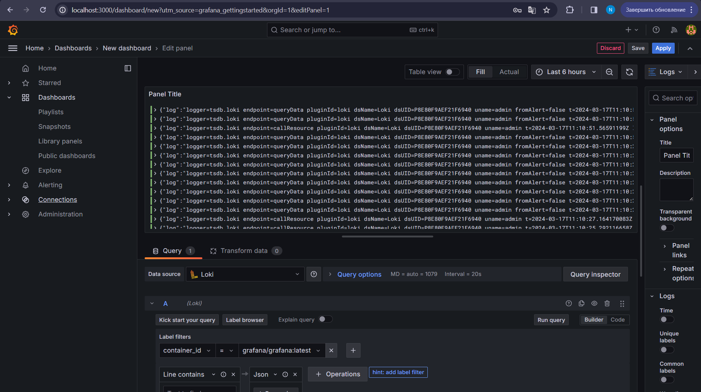
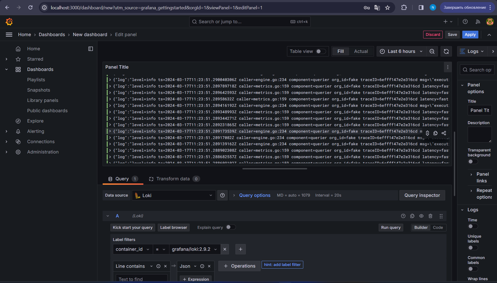

# Logging Stack Report

## Grafana Configuration

This section outlines the setup for Grafana within Docker Compose configuration, detailing how Grafana is integrated
with specific settings and connected to a Loki data source.

- **Environment Variables**: Grafana is configured through the following environment variables:
    - `GF_PATHS_PROVISIONING`: Points to the directory containing provisioning files. These files are utilized by
      Grafana to load its configuration.
    - `GF_AUTH_ANONYMOUS_ENABLED`: Activates the option for users to access Grafana without authentication.
    - `GF_AUTH_ANONYMOUS_ORG_ROLE`: Defines the access level for unauthenticated users, which is set to Admin in this
      setup.

- **Entrypoint**: The entrypoint script for the Grafana container performs several actions:
    - Establishes the directory at `/etc/grafana/provisioning/datasources` for data source configuration.
    - Creates a `ds.yaml` file within that directory to configure Loki as the data source, applying specific settings.
    - Executes the `/run.sh` script to start Grafana.

- **Image**: Utilizes the `grafana/grafana:latest` Docker image for the Grafana service.

- **Ports**: Forwards port 3000 from the host to the Grafana container, enabling access to the Grafana UI.

- **Networks**: Assigns the Grafana container to the `loki` network for seamless communication with Loki and other
  related services.

- **Logging**: Employs a predefined logging configuration from your Docker Compose setup (identified by the *logger
  alias), managing how Grafana's logs are captured and stored.

## Loki Configuration

Loki serves as the core log aggregation system, offering scalable and efficient log storage and query capabilities
within the Grafana observability stack.

- **Image**: Deploys the `grafana/loki:2.9.2` Docker image, incorporating the Loki log aggregation system.

- **Ports**: Maps port 3100 from the host to the Loki container, granting external access to Loki's HTTP API for log
  queries.

- **Command**: Initiates Loki with a command that specifies its configuration file, outlining various operational
  parameters including storage and log labeling.

- **Networks**: Adds Loki to the `loki` network, ensuring it can receive logs from Promtail and interact with Grafana
  for log queries.

- **Logging**: Adopts a shared logging configuration from the Docker Compose file (*logger alias), managing Loki's log
  output.

## Promtail Setup

Promtail acts as the log collection agent, responsible for gathering logs from different sources and forwarding them to
Loki for storage and processing.

- **Image**: Specifies the `grafana/promtail:2.9.0` Docker image, which is optimized for log scraping and forwarding to
  Loki.

- **Volumes**: Integrates two key volumes into the Promtail container:
    - `/var/lib/docker/containers:/var/lib/docker/containers` enables access to Docker container logs for scraping.
    - `./promtail.yaml:/etc/promtail/config.yml` mounts the local `promtail.yaml` configuration file inside the
      container, dictating how logs should be collected and where they should be sent.

- **Command**: The container is initiated with a command that points to the Promtail configuration file, ensuring
  Promtail starts with the correct settings.

- **Networks**: Connects Promtail to the `loki` network, facilitating communication with Loki and other networked
  services for log forwarding.

- **Logging**: Uses a centralized logging configuration defined in the Docker Compose file (denoted by the *logger
  alias), which governs the handling of Promtail's logs.

